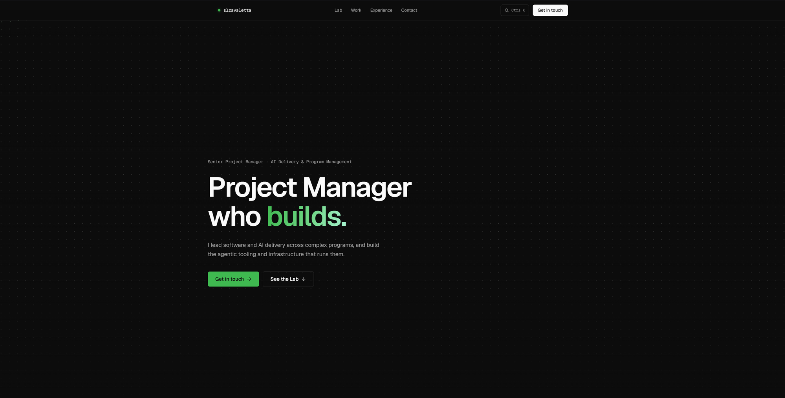

<div align="center">

# Santiago López Zavaletta — personal site

_Project Manager who builds._ Single-page, dark-editorial portfolio for a Senior AI Project Manager.

[](https://nextjs.org)
[](https://react.dev)
[](https://tailwindcss.com)
[](https://www.typescriptlang.org)
[](https://vercel.com)

**[slzavaletta.com](https://slzavaletta.com)**



</div>

## Highlights

- **One accent, locked.** Signal green `#3FB950` across the page; the `#3FB950 → #A7F3D0` gradient lives in exactly three spots.
- **Motion with intent.** Entrance / scroll / cursor-driven only, no idle loops, fully `prefers-reduced-motion` safe.
- **Cursor-reactive hero** (Motion values, never React state), **`Cmd`/`Ctrl` + `K`** command palette, and a live **Scope Sentinel** demo - a faithful, pre-computed walkthrough of an agentic Claude skill (no API, no fake loader).

## Stack

Next.js 15 (App Router / RSC) · React 19 · Tailwind v4 · Motion · Geist + Geist Mono · Phosphor · Vercel (Analytics + Speed Insights) · TypeScript.

## Run it

> Node 18.18+ (20+ recommended)

```bash
npm install
npm run dev      # http://localhost:3000
npm run build    # production build (static)
```

## Where things live

```
app/
├─ page.tsx          # the single page, section by section
├─ layout.tsx        # metadata, fonts, JSON-LD, analytics
├─ globals.css       # Tailwind v4 tokens + design locks
├─ lib/content.ts    # all copy + data (edit the site here)
└─ components/       # sections + components/motion/* (canvas, reveals, demos)
public/logos/        # vendored, mono-normalized tech logos
```

Most edits are just `app/lib/content.ts`. Deployed on Vercel; pushes to `main` ship automatically.

---

<div align="center"><sub>The manager an engineer respects and a VP understands.</sub></div>
